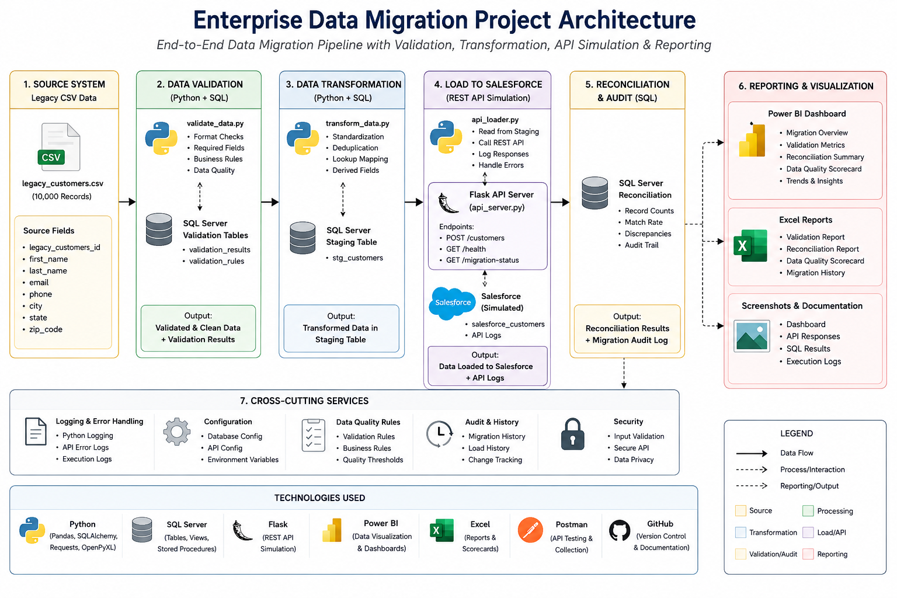
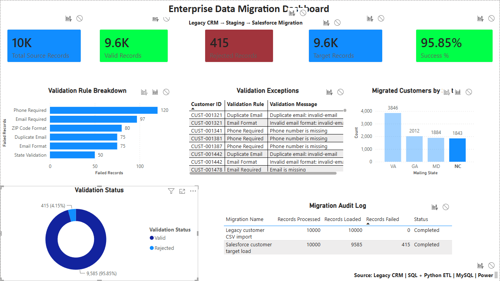
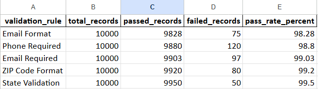
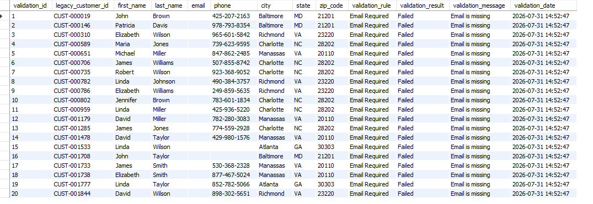
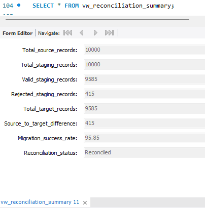
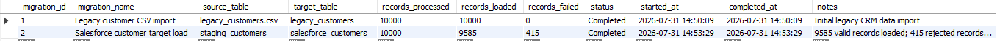
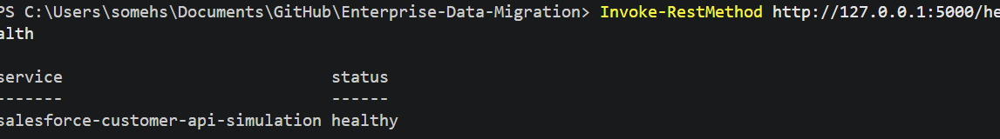
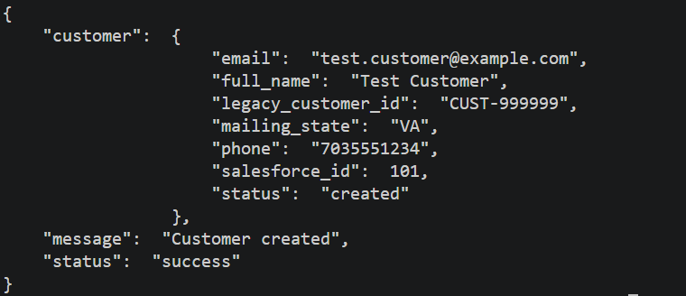
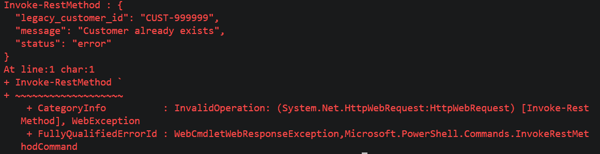
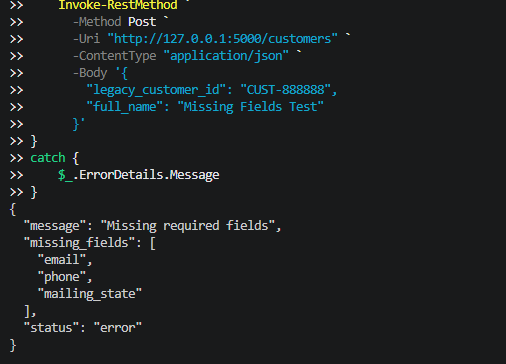

# Enterprise Data Migration & API Integration Platform

## Overview

This project simulates an end-to-end enterprise customer data migration from a legacy CRM system into a Salesforce-like target environment. It demonstrates SQL database design, ETL processing, Python automation, REST API development, data validation, reconciliation, audit logging, and Power BI reporting.

---

## Architecture



---

## Power BI Dashboard



---

## Technology Stack

- Python
- MySQL
- SQL
- Flask
- REST APIs
- Power BI
- Pandas
- Requests
- OpenPyXL
- Git
- GitHub

---

## Project Features

- Generated 10,000 realistic customer records
- Imported legacy customer data into MySQL
- Built a complete ETL pipeline
- Implemented automated data validation
- Loaded validated records into a Salesforce-style target table
- Created reconciliation and migration audit reports
- Developed a REST API using Flask
- Implemented duplicate detection and request validation
- Automated API data loading
- Built an executive Power BI dashboard

---

## End-to-End Workflow

```text
Legacy Customer CSV
        │
        ▼
Python Data Generator
        │
        ▼
MySQL Source Database
        │
        ▼
Data Validation
        │
        ▼
Staging Tables
        │
        ▼
Salesforce Target
        │
        ▼
REST API
        │
        ▼
Power BI Dashboard
```

---

## Database Workflow

1. Generate legacy customer data
2. Import customer records into MySQL
3. Validate customer data
4. Transform records into staging
5. Load validated records into the Salesforce target table
6. Generate reconciliation and validation reports
7. Test REST API endpoints
8. Visualize migration metrics in Power BI

---

## REST API Endpoints

| Method | Endpoint | Description |
|---------|----------|-------------|
| GET | `/health` | API health check |
| GET | `/customers` | Retrieve all customers |
| GET | `/customers/{legacy_customer_id}` | Retrieve a customer |
| POST | `/customers` | Create a customer |
| GET | `/migration-status` | View migration status |

---

## Validation Rules

- Email Required
- Phone Required
- Email Format
- Duplicate Email
- ZIP Code Format
- State Validation

---

## Project Structure

```text
Enterprise-Data-Migration/
│
├── api/
├── data/
├── docs/
├── powerbi/
├── python/
├── screenshots/
├── sql/
├── validation/
│
├── README.md
├── requirements.txt
└── .gitignore
```

---

# Screenshots

## Power BI Dashboard


---

## Validation Scorecard



---

## Validation Results



---

## Reconciliation Summary



---

## Migration Execution Log



---

## API Health Check



---

## Successful API Request



---

## Duplicate Detection



---

## Validation Error



---

## How to Run

### Clone the repository

```bash
git clone https://github.com/somesh3516/Enterprise-Data-Migration.git
cd Enterprise-Data-Migration
```

### Install dependencies

```bash
pip install -r requirements.txt
```

### Execute SQL Scripts

Run the SQL scripts in the following order:

```
01_database_setup.sql
02_import_legacy_data.sql
03_data_validation.sql
04_transform_staging.sql
05_load_salesforce.sql
06_reconciliation.sql
07_reporting_views.sql
08_validation_queries.sql
```

### Generate Reports

```bash
python python/generate_reports.py
```

### Start the REST API

```bash
python python/api_server.py
```

### Run the API Loader

```bash
python python/api_loader.py
```

### Open the Power BI Dashboard

```
powerbi/Enterprise_Data_Migration_Dashboard.pbix
```

---

## Skills Demonstrated

- SQL Database Design
- ETL Development
- Data Migration
- Data Validation
- Data Quality Management
- Data Reconciliation
- REST API Development
- Python Automation
- Power BI Dashboard Development
- Reporting & Analytics
- Audit Logging
- Git Version Control

---

## Future Enhancements

- Docker containerization
- Live Salesforce integration
- User authentication
- Cloud deployment
- GitHub Actions CI/CD

---

## Author

**Somesh Dixit**

GitHub: https://github.com/somesh3516
